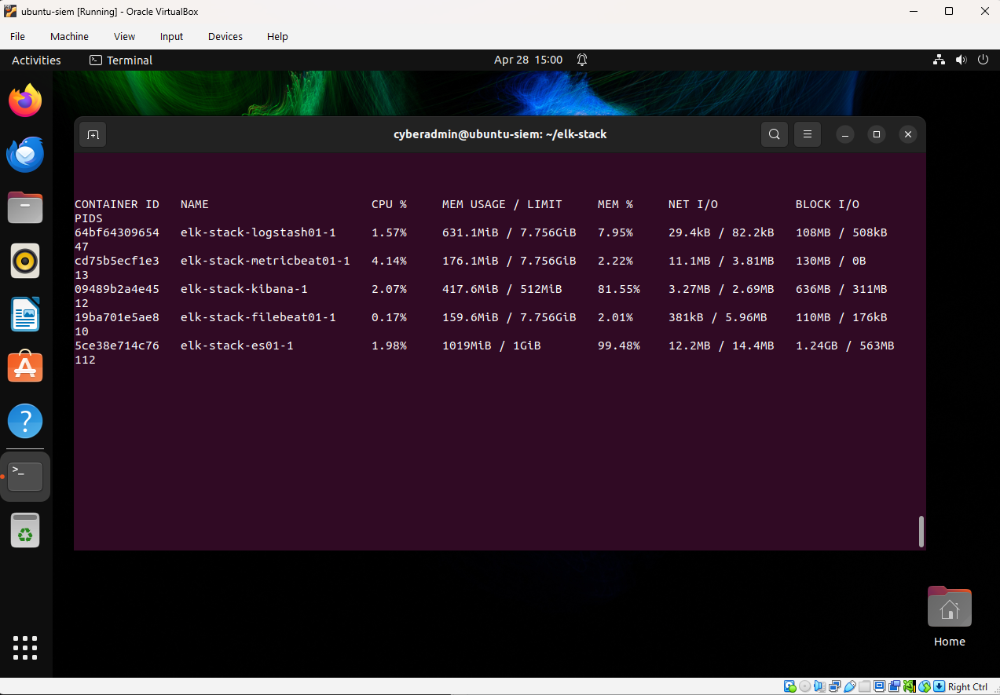
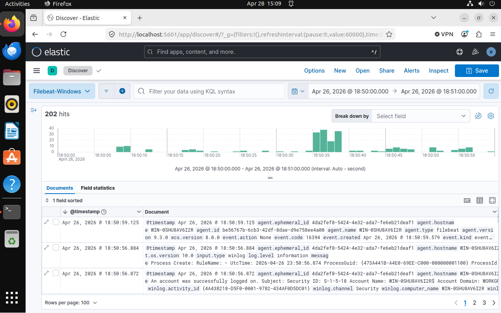
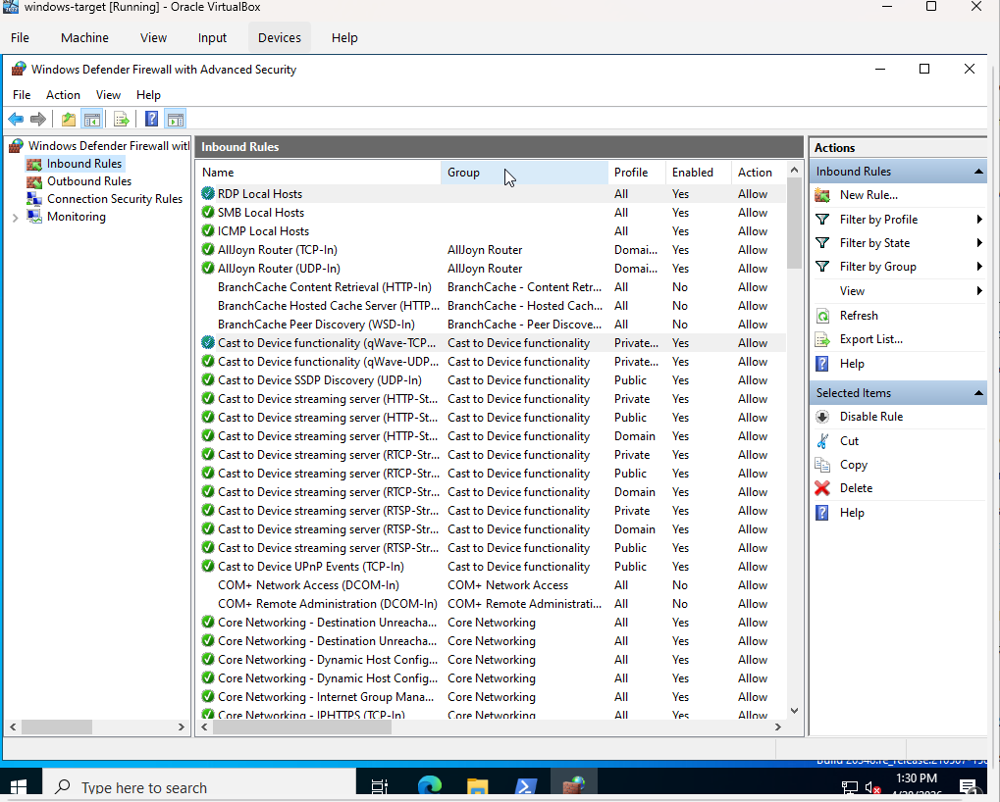
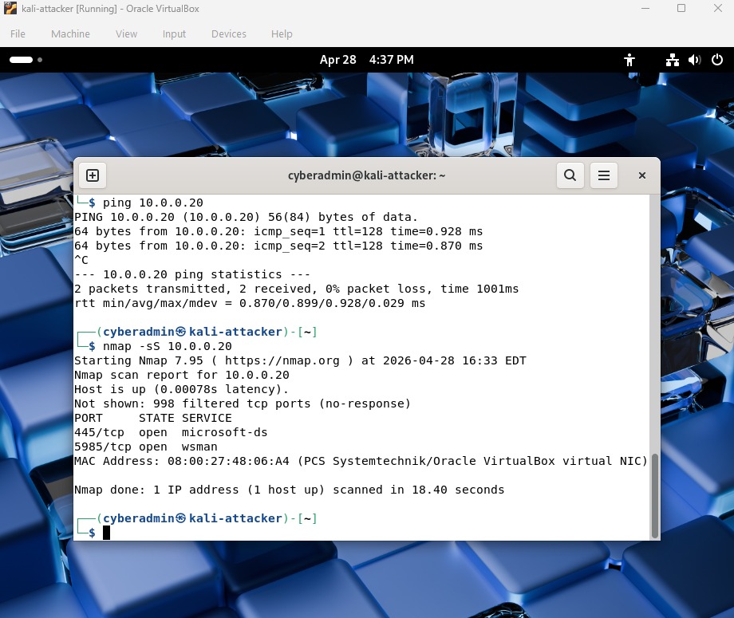

# ELK Stack SIEM Lab
## Project Overview
In this project I built an SIEM lab using ELK Stack and virtual machines ran on VirtualBox to monitor and detect suspicious activity across a virtual network environment.

## Architecture
- Kali Linux (attacker)
- Windows VM (target + Sysmon)
- Ubuntu (ELK stack)

## Key Features
- Centralized logging (ELK)
- Windows telemetry (Sysmon)
- Network traffic analysis (Wireshark / tcpdump)
- Attack simulation (Nmap, PowerShell)

## Detection Scenarios
### Suspicious Powershell Activity
- Simulated attacker behavior by executing PowerShell commands on the Windows VM
- Sysmon captured process creation events (Event ID 1)
- Logs were forwarded and analyzed in Kibana

### Failed Login
- Simulated repeated login attempts against the Windows VM
- Windows Security logs captured failed authentication events
- Highlighted potential brute force or credential guessing behavior

### Network Connection Monitoring 
- Generated network traffic between attacker (Kali) and target (Windows)
- Sysmon network connection logs (Event ID 3) were collected when available
- Observed limited network connection logs due to Sysmon’s focus on TCP/UDP connections

### Key Insight
During testing, it was observed that endpoint telemetry (Sysmon) does not capture all network activity types by default, particularly ICMP and some scan behaviors depending on configuration. This demonstrates the limitation of endpoint-only visibility and reinforces the need for complementary network-level monitoring in security environments.

## Security Configurations
### Firewall Policies
“The Windows host was configured with a restrictive firewall policy, allowing inbound traffic only from known lab machines (Ubuntu and Kali) while blocking all other unsolicited connections. Specific rules were created to permit ICMP and necessary service traffic to support testing and log generation.”

### Network Exposure Validation
An Nmap TCP SYN scan was performed against the Windows host. The results showed only two open ports: TCP 445 (SMB) and TCP 5985 (WinRM), both intentionally enabled for controlled testing. All other ports were reported as filtered, indicating that the Windows Defender Firewall was actively blocking unsolicited traffic.

## Screenshots 
### ELK Stack Running in Terminal 

### Kibana Dashboard 

### Custom Windows Configuration 

### Kali NMAP on Windows

## Skills Demonstrated
- SIEM (ELK Stack)
- Networking (TCP/IP, ports, scanning)
- Linux (Ubuntu, tcpdump)
- Windows security (Sysmon, Event Logs)
- Threat detection & analysis

